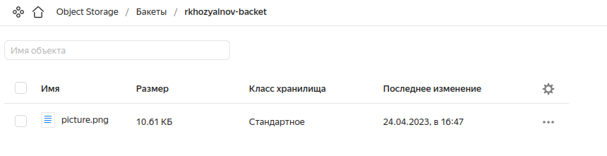
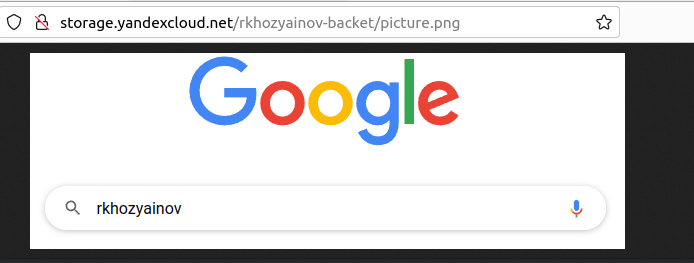
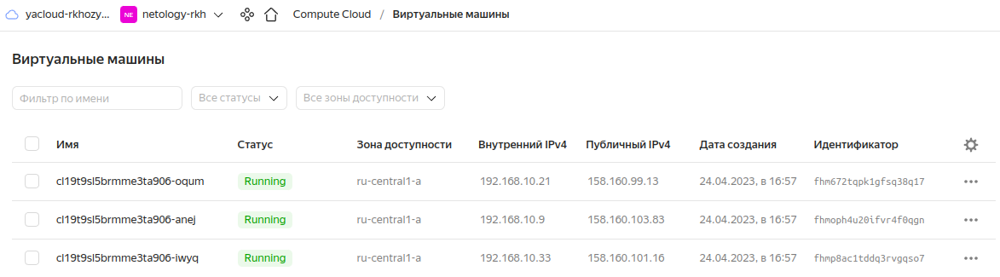
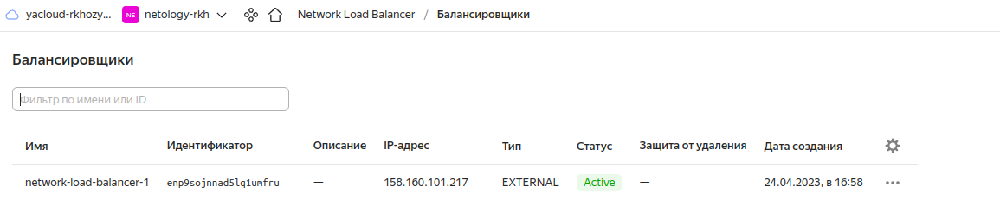
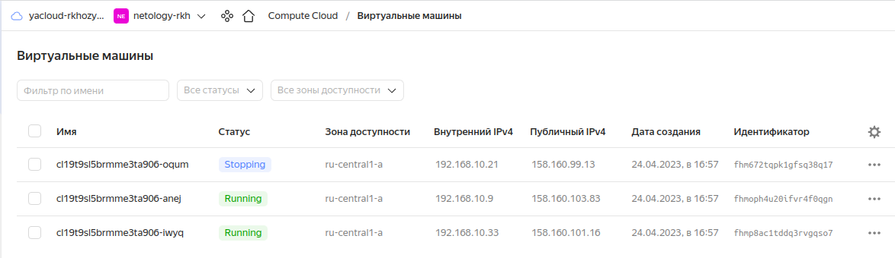
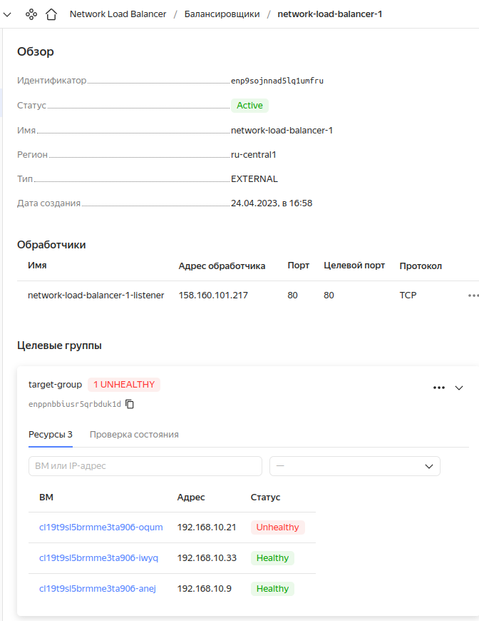
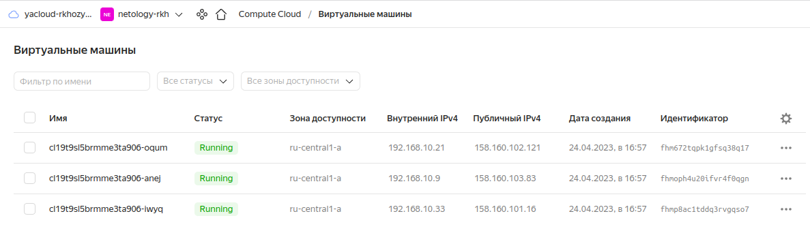
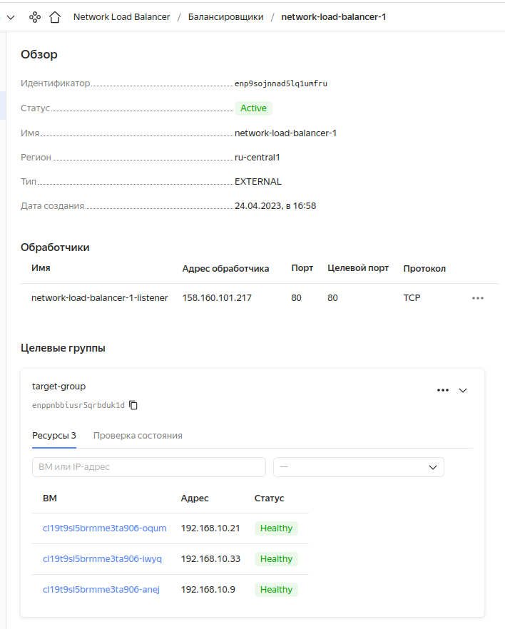

# Домашнее задание к занятию «Вычислительные мощности. Балансировщики нагрузки»  

---
## Задание 1. Yandex Cloud 

**Что нужно сделать**

1. Создать бакет Object Storage и разместить в нём файл с картинкой:

 - Создать бакет в Object Storage с произвольным именем (например, _имя_студента_дата_).
 - Положить в бакет файл с картинкой.
 - Сделать файл доступным из интернета.
 
2. Создать группу ВМ в public подсети фиксированного размера с шаблоном LAMP и веб-страницей, содержащей ссылку на картинку из бакета:

 - Создать Instance Group с тремя ВМ и шаблоном LAMP. Для LAMP рекомендуется использовать `image_id = fd827b91d99psvq5fjit`.
 - Для создания стартовой веб-страницы рекомендуется использовать раздел `user_data` в [meta_data](https://cloud.yandex.ru/docs/compute/concepts/vm-metadata).
 - Разместить в стартовой веб-странице шаблонной ВМ ссылку на картинку из бакета.
 - Настроить проверку состояния ВМ.
 
3. Подключить группу к сетевому балансировщику:

 - Создать сетевой балансировщик.
 - Проверить работоспособность, удалив одну или несколько ВМ.
4. (дополнительно)* Создать Application Load Balancer с использованием Instance group и проверкой состояния.


### Ответ  

[provider.tf](yc/provider.tf)  
[variables.tf](yc/variables.tf)  
[main.tf](yc/main.tf)  
[network.tf](yc/network.tf)  
[sa.tf](yc/sa.tf)  
[backet.tf](yc/backet.tf)  
[instance_group.tpl](yc/instance_group.tpl)  
[cloud_init_config.tpl](yc/cloud_init_config.tpl)  
[lb.tpl](yc/lb.tpl)  

1. Создаем VPC, подсети. Переменные определены в variables, параметры провайдера в provider, сети и подсети в network

2. Создаём сервисные аккаунты в sa.   
Для бакетов и загрузки в них нужен SA c ролью storage.editor и статическими ключами доступа  
```
resource "yandex_iam_service_account" "sa-backet" {
  name = "sa-backet"
}

resource "yandex_resourcemanager_folder_iam_member" "sa-backet-editor" {
  folder_id = var.yandex_folder_id
  role      = "storage.editor"
  member    = "serviceAccount:${yandex_iam_service_account.sa-backet.id}"
}

resource "yandex_iam_service_account_static_access_key" "sa-backet-static-key" {
  service_account_id = yandex_iam_service_account.sa-backet.id
  description        = "static access key for object storage"
}
```
Для группы ВМ с NLB нужна роль editor  

```
resource "yandex_iam_service_account" "sa-ig1" {
  name        = "sa-ig1"
  description = "service account to manage IG"
}

resource "yandex_resourcemanager_folder_iam_member" "editor" {
  folder_id = var.yandex_folder_id
  role      = "editor"
  member   = "serviceAccount:${yandex_iam_service_account.sa-ig1.id}"
}
```
3. Создаём бакет. force_destroy = true необходим для корректного удаления. доступ к бакету определяется в anonymous_access_flags. 
```
resource "yandex_storage_bucket" "rkhozyainov-backet" {
  access_key = yandex_iam_service_account_static_access_key.sa-backet-static-key.access_key
  secret_key = yandex_iam_service_account_static_access_key.sa-backet-static-key.secret_key
  bucket     = "rkhozyainov-backet"
  force_destroy = true 
  anonymous_access_flags {
    read = true
    list = false
  }
}
```

4.  Загружаем картинку(объект) в созданный бакетю Указываем content_type = "image/png" для корректного отображения и определяем доступ к этому объекту в acl  
```
resource "yandex_storage_object" "picture" {
  access_key = yandex_iam_service_account_static_access_key.sa-backet-static-key.access_key
  secret_key = yandex_iam_service_account_static_access_key.sa-backet-static-key.secret_key
  bucket     = "rkhozyainov-backet"
  key        = "picture.png"
  source     = "./picture.png"
  content_type = "image/png"
  acl = "public-read"
  depends_on = [
    yandex_storage_bucket.rkhozyainov-backet
  ]
}
```
Проверка  
  
  
5. Создаём группу ВМ по инструкции - https://cloud.yandex.ru/docs/compute/operations/instance-groups/create-with-balancer. 
Генерируем ssh ключи и сохраняем в файл  
```
resource "tls_private_key" "ssh-key" {
  algorithm = "RSA"
  rsa_bits  = 4096
}
resource "local_sensitive_file" "id_rsa" {
  filename = "ssh_key"
  file_permission = "600"
  content = tls_private_key.ssh-key.private_key_pem
}
```
Создаём группу ВМ. Используем созданный SA sa-ig1, ресурсы 2/4, образ, подсеть указаны в variables.  
```
resource "yandex_compute_instance_group" "ig-1" {
  name               = "fixed-ig-with-balancer"
  folder_id = var.yandex_folder_id
  service_account_id = "${yandex_iam_service_account.sa-ig1.id}"
  instance_template {
    platform_id = "standard-v3"
    resources {
      memory = 4
      cores  = 2
    }

    boot_disk {
      mode = "READ_WRITE"
      initialize_params {
        image_id = var.iso_id
      }
    }

    network_interface {
      subnet_ids = ["${yandex_vpc_subnet.yc-subnet-a.id}"]
      nat = true
    }
```

С помощью metadata - user-data, data "template_file" "cloud_init" и шаблона cloud_init_config указываем ssh ключи для подключения, и генерируем index.html  
```
metadata = {
      user-data = data.template_file.cloud_init.rendered
    }
```
cloud_init_config.tpl
```
#cloud-config
users:
  - name: ${user}
    groups: sudo
    shell: /bin/bash
    sudo: ['ALL=(ALL) NOPASSWD:ALL']
    ssh-authorized-keys:
      - ${ssh_key}
write_files:
- content: |
    <!DOCTYPE html>
      <html lang="en">
        <head>
          <meta charset="utf-8">
          <title>title</title>
        </head>
        <body>
          Hello, world!<br>
          
        </body>
      </html>
  path: /var/www/html/index.html
  owner: root:root
  permissions: '0644'
```
Колличество ВМ в группе  - 3, зона доступности определена в variables максимальное кол-во недоступных ВМ - 1, балансировщик - target-group
```
cale_policy {
    fixed_scale {
      size = 3
    }
  }

  allocation_policy {
    zones = var.yandex_zone
  }

  deploy_policy {
    max_unavailable = 1
    max_expansion   = 0
  }

  load_balancer {
    target_group_name        = "target-group"
    target_group_description = "load balancer target group"
  }
}
```
6. Создаём сетевой балансировщик. listener на 80 порту. Группа созданная на предыдущем шаге, хелсчек по http, ждём создания группы ВМ.   
```
resource "yandex_lb_network_load_balancer" "lb-1" {
  name = "network-load-balancer-1"

  listener {
    name = "network-load-balancer-1-listener"
    port = 80
    external_address_spec {
      ip_version = "ipv4"
    }
  }

  attached_target_group {
    target_group_id = yandex_compute_instance_group.ig-1.load_balancer.0.target_group_id

    healthcheck {
      name = "http"
      http_options {
        port = 80
        path = "/index.html"
      }
    }
  }
  depends_on = [
    yandex_compute_instance_group.ig-1
  ]
}
```
Проверки:
  
  
  

Останавливаем 1 ВМ и смотрим статус балансировщика   
  


Через некоторое время...

Останавливаем 1 ВМ и смотрим статус балансировщика   
  



   


